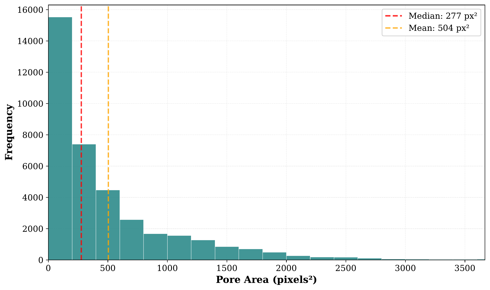
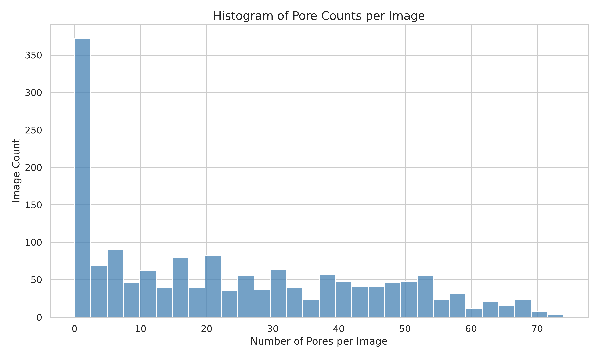
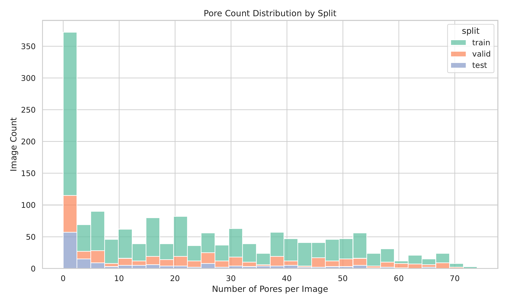
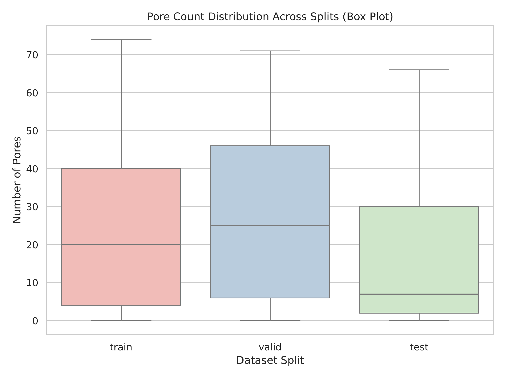
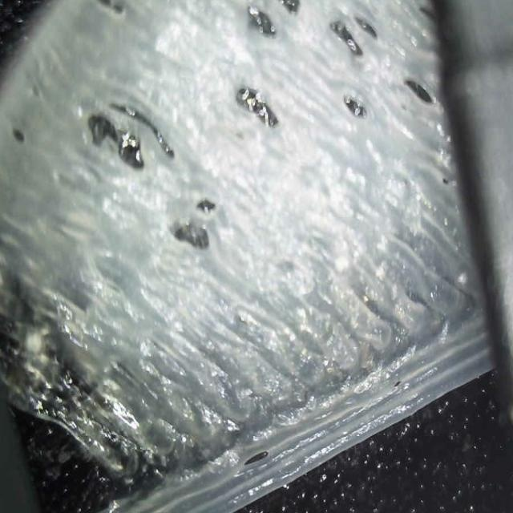
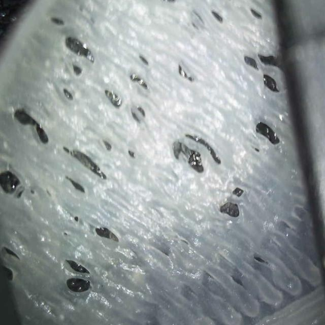
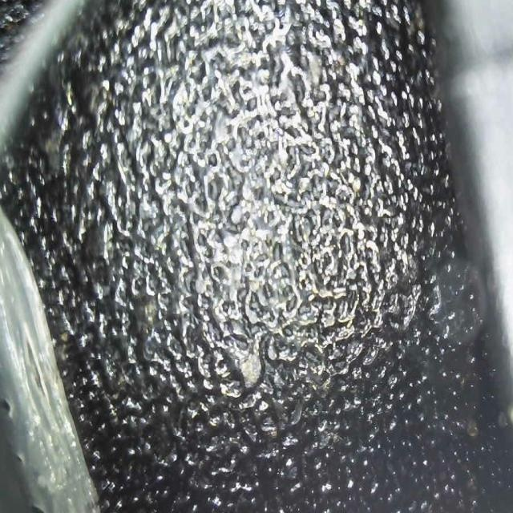
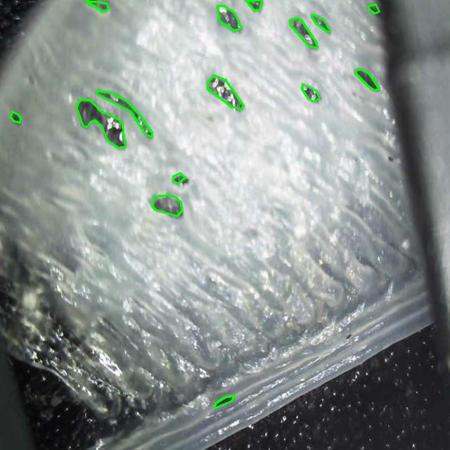
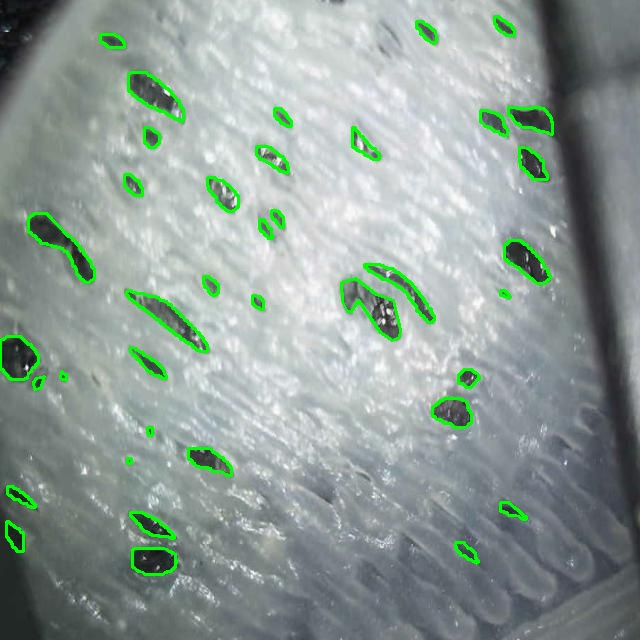
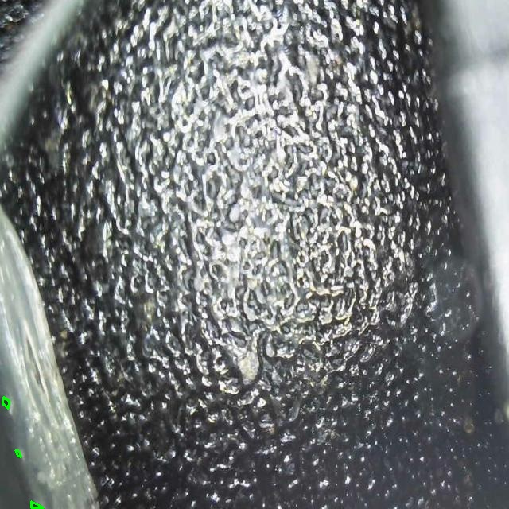

# FDM Pore Detection Dataset

[](https://opensource.org/licenses/MIT)
[](https://github.com/alahad102/fdm-pore-detection-dataset)

> **Annotated pixel-level pore segmentation dataset for Fused Deposition Modeling (FDM) 3D printing quality control**

This repository contains the first publicly available annotated dataset for pore detection in FDM 3D printed parts using continuous fiber-filled (CFF) biopolymer composites.

---

## 📊 Dataset Overview

- **Total Images:** 1,607
- **Total Annotated Pores:** 37,666
- **Format:** YOLO segmentation format (polygon annotations)
- **Material:** CFF/PBS composite
- **Printer:** QIDI Tech X-CF Pro
- **Printing Speed:** 40 mm/s

### Dataset Splits

| Split      | Images | Percentage |
|------------|--------|------------|
| Train      | 1,284  | 80%        |
| Validation | 161    | 10%        |
| Test       | 162    | 10%        |

---

---

## 📊 Dataset Statistics

### Pore Size Distribution


- **Median Area:** 277 pixels²
- **Mean Area:** 504 pixels²
- **Range:** 1.5 – 7,889 pixels²
- **Small Pores (<300 px²):** 52%
- **Large Pores (>1000 px²):** 16%

### Pore Count Distribution


### Dataset Split Comparison
<p float="left">
  
  
</p>

The training, validation, and test splits are balanced with similar pore count distributions.
---

---

## 📥 Dataset Download

The dataset is publicly available on Zenodo:

🔗 https://doi.org/10.5281/zenodo.19009033

This dataset contains annotated pore segmentation masks extracted from in-situ FDM 3D printing video recordings.  
It is provided in multiple formats to support different machine learning frameworks:

- YOLOv8 segmentation format
- COCO segmentation format
- Pascal VOC format
- TensorFlow TFRecord format
- SAM2 compatible format


If you use this dataset in your research, please cite our paper and the dataset.

---

## 🖼️ Sample Images

### Raw Images (Camera Input)
<p float="left">
  
  
  
</p>

### Annotated Images (With Pore Segmentation)
<p float="left">
  
  
  
</p>


## 🎓 Citation

If you use this dataset in your research, please cite our paper:

```bibtex
@InProceedings{Al_Ahad_Khan_2026_WACV,
    author    = {Al Ahad Khan, Abdullah and Islam, Md Shariful and Li, Lin and Jiang, Lai and Ghaffari, Noushin},
    title     = {Automated Pore Detection from In-Situ FDM 3D Printing Video: A Comparative Evaluation of Modern Segmentation Models},
    booktitle = {Proceedings of the IEEE/CVF Winter Conference on Applications of Computer Vision (WACV)},
    month     = {March},
    year      = {2026},
    pages     = {4673-4681}
}
 ```

## 📄 License

This dataset is released under the MIT License. You are free to use it for research and commercial purposes. We only ask that you cite our paper.

---

## 📧 Contact

For questions about the dataset, please open an issue on this repository or contact the corresponding author.

---

## 🙏 Acknowledgments

This research work is supported in part by the Air Force Office of Scientific Research (AFOSR) under award number FA9550-23-1-0725 and the National Science Foundation (NSF) under award number 1900699. The views, findings, and conclusions contained in this paper are those of
the authors and should not be interpreted as representing the official policies, either expressed or implied, of the AFOSR, the NSF, or the U.S. government.

---

**Last Updated:** December 2025
